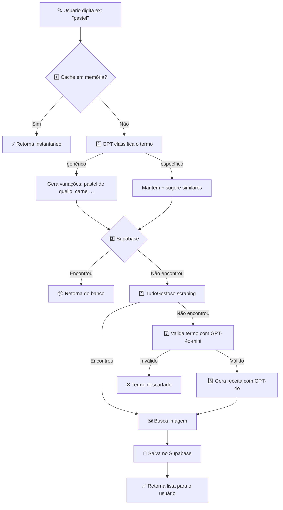

<div align="center">

<!-- HEADER -->
<picture>
  
</picture>

<br/>

# 🍳 Comidinhas

### Descubra, salve e prepare receitas — turbinado por IA

<br/>

[](https://developer.android.com)
[](https://kotlinlang.org)
[](https://developer.android.com/jetpack/compose)
[](https://openai.com)
[](https://supabase.com)

<br/>

<sub>Scraping inteligente · GPT-4o · Brave Search · Material 3 · Clean Architecture</sub>

</div>

<br/>

## 💡 Sobre

**Comidinhas** é um app Android que combina **scraping inteligente**, **GPT** e **busca de imagens** para entregar receitas reais de forma rápida e bonita.

O usuário digita o nome de qualquer prato e o app busca primeiro em **cache**, depois no **banco de dados**, depois no **TudoGostoso** — e só chama a **OpenAI** como último recurso.
O resultado é apresentado com imagens, ingredientes e modo de preparo passo a passo.

<br/>

## ✨ Funcionalidades

<table>
<tr><td>🔍</td><td><b>Busca de receitas por termo livre</b></td><td align="center">✅</td></tr>
<tr><td>🕷️</td><td><b>Scraping do TudoGostoso</b> (fonte principal)</td><td align="center">✅</td></tr>
<tr><td>🤖</td><td><b>Geração de receitas via GPT-4o</b> (fallback)</td><td align="center">✅</td></tr>
<tr><td>🧠</td><td><b>Validação de termo culinário</b> via IA</td><td align="center">✅</td></tr>
<tr><td>✏️</td><td><b>Correção inteligente de termos</b> (ex: "lasanhe" → "lasanha")</td><td align="center">✅</td></tr>
<tr><td>💾</td><td><b>Cache em memória</b> + persistência no Supabase</td><td align="center">✅</td></tr>
<tr><td>🖼️</td><td><b>Imagens via Brave Search API</b></td><td align="center">✅</td></tr>
<tr><td>📌</td><td><b>Salvar receitas automaticamente</b></td><td align="center">✅</td></tr>
<tr><td>📍</td><td><b>Modo "Comer fora"</b> com mapa de restaurantes</td><td align="center">✅</td></tr>
<tr><td>🛵</td><td><b>Modo Delivery</b></td><td align="center">🔜</td></tr>
</table>

<br/>

## 🏗️ Arquitetura

O projeto segue **Clean Architecture** com camadas bem definidas:

```
app/src/main/java/br/com/boddenb/comidinhas/
│
├─ 📂 data
│  ├─ cache/            Cache em memória de buscas
│  ├─ correction/       Correção de termos via Supabase
│  ├─ image/            Busca de imagens (Brave / Unsplash)
│  ├─ model/            Entidades de dados (RecipeEntity …)
│  ├─ parser/           Parsing das respostas da OpenAI
│  ├─ remote/           OpenAiClient, ChatService
│  ├─ repository/       Implementações (Supabase, AWS legacy)
│  ├─ scraper/          TudoGostosoScraper + detalhes
│  └─ util/             fixEncoding, helpers
│
├─ 📂 domain
│  ├─ model/            RecipeItem, Recipe, RecipeSearchResponse
│  ├─ repository/       Interfaces de repositório
│  └─ usecase/          SearchAndFetchTudoGostoso, SaveRecipe …
│
├─ 📂 ui
│  ├─ screen/
│  │  ├─ home/          HomeScreen + HomeViewModel
│  │  ├─ details/       DetailsScreen (receita completa)
│  │  └─ eatout/        EatOutScreen (restaurantes)
│  └─ components/       Componentes reutilizáveis
│
└─ 📂 di                Módulos Hilt (DI)
```

<br/>

## 🔄 Fluxo de busca



<br/>

## 🛠️ Tech Stack

<table>
<tr>
  <th align="left">Camada</th>
  <th align="left">Tecnologia</th>
</tr>
<tr>
  <td><b>Linguagem</b></td>
  <td></td>
</tr>
<tr>
  <td><b>UI</b></td>
  <td> </td>
</tr>
<tr>
  <td><b>DI</b></td>
  <td></td>
</tr>
<tr>
  <td><b>HTTP</b></td>
  <td></td>
</tr>
<tr>
  <td><b>Serialização</b></td>
  <td></td>
</tr>
<tr>
  <td><b>Backend / DB</b></td>
  <td> </td>
</tr>
<tr>
  <td><b>IA — Receitas</b></td>
  <td></td>
</tr>
<tr>
  <td><b>IA — Validação</b></td>
  <td></td>
</tr>
<tr>
  <td><b>Scraping</b></td>
  <td></td>
</tr>
<tr>
  <td><b>Imagens</b></td>
  <td> </td>
</tr>
<tr>
  <td><b>Image Loading</b></td>
  <td></td>
</tr>
<tr>
  <td><b>Navegação</b></td>
  <td></td>
</tr>
</table>

<br/>

## 🗄️ Banco de dados

<details>
<summary><b><code>comidinhas-recipe</code></b> — Receitas geradas ou extraídas do TudoGostoso</summary>

<br/>

| Coluna | Tipo | Descrição |
|---|---|---|
| `id` | `uuid` | Chave primária |
| `name` | `text` | Nome da receita |
| `ingredients` | `jsonb` | Lista de ingredientes |
| `instructions` | `jsonb` | Passos do modo de preparo |
| `image_url` | `text` | URL da imagem no Storage |
| `cooking_time` | `text` | Tempo de preparo |
| `servings` | `text` | Número de porções |
| `search_query` | `text` | Termo usado na busca |
| `source` | `text` | Origem: `openai`, `tudogostoso`, etc. |
| `created_at` | `timestamptz` | Data de criação |

</details>

<details>
<summary><b><code>term_corrections</code></b> — Cache de correções de termos</summary>

<br/>

| Coluna | Tipo | Descrição |
|---|---|---|
| `id` | `uuid` | Chave primária |
| `original_term` | `text` | Termo digitado pelo usuário (unique) |
| `corrected_term` | `text` | Termo corrigido |
| `hit_count` | `integer` | Quantas vezes foi acessado |
| `created_at` | `timestamptz` | Data de criação |

</details>

<details>
<summary><b>📁 Storage</b> — Bucket de imagens</summary>

<br/>

O bucket `comidinhas-recipe-images` no Supabase armazena as imagens das receitas com acesso público.

```
comidinhas-recipe-images/
└── {uuid}.jpg
```

URL pública:
```
https://{project}.supabase.co/storage/v1/object/public/comidinhas-recipe-images/{uuid}.jpg
```

</details>

<br/>

## ⚙️ Configuração

<details>
<summary><b>Variáveis de ambiente</b></summary>

<br/>

Configure em `local.properties`:

```properties
# OpenAI
OPENAI_API_KEY=sk-...

# Supabase
SUPABASE_URL=https://xxxxxxxxxxx.supabase.co
SUPABASE_ANON_KEY=eyJ...

# Brave Search (imagens)
BRAVE_API_KEY=BSAP...

# Unsplash (fallback de imagens)
UNSPLASH_CLIENT_ID=...
```

</details>

<details>
<summary><b>Feature toggles</b></summary>

<br/>

| Arquivo | Constante | Descrição |
|---|---|---|
| `OpenAiClient.kt` | `TUDO_GOSTOSO_ENABLED` | Liga/desliga scraping do TudoGostoso |
| `DallEImageGenerator.kt` | `IMAGE_SOURCE` | Fonte de imagens: `BRAVE`, `UNSPLASH` ou `DALLE` |

</details>

<br/>

## 🚀 Como rodar

```bash
# 1. Clone o repositório
git clone https://github.com/Boddenberg/comidinhas.git

# 2. Abra no Android Studio (Hedgehog ou superior)

# 3. Configure as chaves de API em local.properties

# 4. Rode em dispositivo ou emulador — Android 8.0+ (API 26+)
```

<br/>

## 📋 Changelog

<details>
<summary><b>v1.6</b> — Qualidade de resultado: imagem obrigatória, deduplicação e logs</summary>

- TudoGostoso: se top 1 não tem imagem, tenta candidatos seguintes
- Receita descartada se a URL da imagem retornar erro HTTP
- Deduplicação por `imageUrl` antes do save
- Log estruturado de receitas descartadas com motivo
- `BraveWebSearchDiscovery`: migrado de Google scraping para Brave Web Search API
- `RecipeSupabaseRepository`: validação de Content-Type antes do upload
- Logs de request/response HTTP explícitos por requisição

</details>

<details>
<summary><b>v1.5</b> — Correção crítica: filtro de busca no Supabase ignorado</summary>

- Bug: `RecipeEntity` usava camelCase sem `@SerialName`, causando mismatch com colunas snake_case
- O filtro `eq("searchQuery", ...)` era ignorado — retornava TODAS as receitas da tabela
- Correção: `@SerialName` adicionado em todos os campos snake_case
- Filtro corrigido para `eq("search_query", ...)`

</details>

<details>
<summary><b>v1.4</b> — Acessibilidade e legibilidade na tela de detalhes</summary>

- Subtítulos agora legíveis (alpha removido)
- Cards trocados para branco puro com elevation 1dp
- Interior dos cards usa Surface0 (creme suave)
- Bolha do número do passo com contraste adequado

</details>

<details>
<summary><b>v1.3</b> — Expansão de queries + card de destaque visual</summary>

- GPT classifica o termo: genérico ou específico
- Busca genérica gera até 5 variações em paralelo
- Card de destaque com borda brilhante animada (sweep gradient)
- Supabase busca pelo termo raiz genérico

</details>

<details>
<summary><b>v1.2</b> — Detalhes da receita + correções de navegação</summary>

- Tela de detalhes reformulada com layout editorial
- `RecipeHeroHeader`, `IngredientsCard`, `StepsTimelineCard`
- `AppShapes` com corners maiores (8/12/16/24/32dp)
- Typography reforçada e tokens de espaçamento centralizados
- Correção do botão voltar e reset do modo "Comer fora"

</details>

<details>
<summary><b>v1.1</b> — Qualidade de código (SOLID + StateFlow)</summary>

- `SearchRecipesUseCase` centraliza a orquestração de busca
- `HomeViewModel` migrado para StateFlow imutável
- `OpenAiClient` restrito a HTTP da OpenAI
- `TextNormalizer` centralizado, `AppLogger` global

</details>

<details>
<summary><b>v1.0</b> — Base do projeto</summary>

- Busca de receitas por termo livre
- Geração via GPT-4o com Structured Output
- Validação de termos culinários via GPT-4o-mini
- Scraping do TudoGostoso como fonte principal
- Fallback de imagens: Brave Search → Unsplash
- Persistência de receitas no Supabase
- Modo "Comer fora" com mapa de restaurantes
- UI em Jetpack Compose com Material 3

</details>

<br/>

## 📄 Licença

Este projeto é privado e de uso pessoal.

---

<div align="center">
  <br/>
  <sub>Feito com ❤️ e muita fome</sub>
  <br/><br/>
</div>

