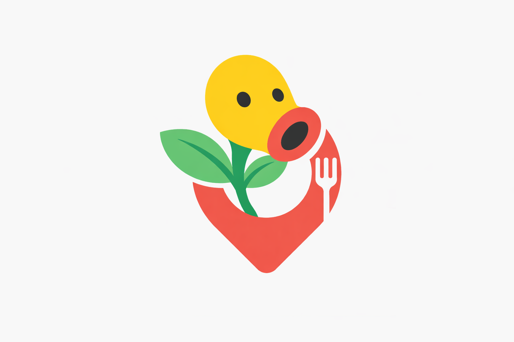

<div align="center">



# Comidinhas

**Descubra, salve e prepare receitas com inteligência artificial.**

[](https://developer.android.com)
[](https://kotlinlang.org)
[](https://developer.android.com/jetpack/compose)
[](https://supabase.com)

</div>

---

## Sobre o projeto

**Comidinhas** é um app Android que combina scraping inteligente, GPT e busca de imagens para entregar receitas reais de forma rápida e bonita. O usuário digita o nome de qualquer prato e o app busca primeiro em cache, depois no banco de dados, depois no TudoGostoso — e só chama a OpenAI como último recurso. O resultado é apresentado com imagens, ingredientes e modo de preparo passo a passo.

---

## Funcionalidades

| Funcionalidade | Status |
|---|---|
| Busca de receitas por termo livre | ✅ |
| Scraping do TudoGostoso (fonte principal) | ✅ |
| Geração de receitas via GPT-4o (fallback) | ✅ |
| Validação de termo culinário via IA | ✅ |
| Correção inteligente de termos (ex: "lasanhe" → "lasanha") | ✅ |
| Cache em memória e persistência no Supabase | ✅ |
| Imagens via Brave Search API | ✅ |
| Salvar receitas automaticamente | ✅ |
| Modo "Comer fora" com mapa de restaurantes | ✅ |
| Modo Delivery | 🔜 Em breve |

---

## Arquitetura

O projeto segue **Clean Architecture** com camadas bem definidas:

```
app/
└── src/main/java/br/com/boddenb/comidinhas/
    ├── data/
    │   ├── cache/          → Cache em memória de buscas
    │   ├── correction/     → Correção de termos via Supabase (term_corrections)
    │   ├── image/          → Busca de imagens (Brave / Unsplash)
    │   ├── model/          → Entidades de dados (RecipeEntity, etc.)
    │   ├── parser/         → Parsing das respostas da OpenAI
    │   ├── remote/         → OpenAiClient, ChatService
    │   ├── repository/     → Implementações (Supabase, AWS legacy)
    │   ├── scraper/        → TudoGostosoScraper + extrator de detalhes
    │   └── util/           → fixEncoding, helpers
    ├── domain/
    │   ├── model/          → RecipeItem, Recipe, RecipeSearchResponse
    │   ├── repository/     → Interfaces de repositório
    │   └── usecase/        → SearchAndFetchTudoGostoso, SaveRecipe, etc.
    ├── ui/
    │   ├── screen/
    │   │   ├── home/       → HomeScreen + HomeViewModel
    │   │   ├── details/    → DetailsScreen (receita completa)
    │   │   └── eatout/     → EatOutScreen (restaurantes)
    │   └── components/     → Componentes reutilizáveis
    └── di/                 → Módulos Hilt (DI)
```

---

## Fluxo de busca

```
Usuário digita "lasanha a bolonhesa"
        │
        ▼
  1. Cache em memória?  ──► Sim → retorna instantâneo
        │ Não
        ▼
  2. Supabase (comidinhas-recipe)?  ──► Sim → retorna receitas salvas
        │ Não
        ▼
  3. Tabela term_corrections?  ──► Encontrou "lasanhe" → "lasanha"?
        │                             └─► Busca novamente no Supabase
        ▼
  4. TudoGostoso scraping
     • Busca interna do site
     • Rankeia por nota × avaliações
     • Extrai JSON-LD ou HTML
        │ Não encontrou
        ▼
  5. Valida termo com GPT-4o-mini
     (filtra: "bolinho de merda", "macarrão de concreto", etc.)
        │ Termo válido
        ▼
  6. Gera receita com GPT-4o (Structured Output)
        │
        ▼
  Busca imagem (Brave Search → Unsplash fallback)
        │
        ▼
  Salva no Supabase + retorna para o usuário
```

---

## Tecnologias

| Camada | Tecnologia |
|---|---|
| Linguagem | Kotlin |
| UI | Jetpack Compose + Material 3 |
| Injeção de dependência | Hilt |
| HTTP Client | Ktor |
| Serialização | kotlinx.serialization |
| Banco de dados | Supabase (PostgreSQL) |
| Storage de imagens | Supabase Storage |
| IA — receitas | OpenAI GPT-4o (Responses API) |
| IA — validação | OpenAI GPT-4o-mini |
| Scraping | Jsoup |
| Imagens | Brave Search API / Unsplash |
| Carregamento de imagens | Coil |
| Navegação | Navigation Compose |

---

## Tabelas no Supabase

### `comidinhas-recipe`
Armazena receitas geradas ou extraídas do TudoGostoso.

| Coluna | Tipo | Descrição |
|---|---|---|
| `id` | uuid | Chave primária |
| `name` | text | Nome da receita |
| `ingredients` | jsonb | Lista de ingredientes |
| `instructions` | jsonb | Passos do modo de preparo |
| `image_url` | text | URL da imagem no Storage |
| `cooking_time` | text | Tempo de preparo |
| `servings` | text | Número de porções |
| `search_query` | text | Termo usado na busca |
| `source` | text | Origem: `openai`, `tudogostoso`, etc. |
| `created_at` | timestamptz | Data de criação |

### `term_corrections`
Cache de correções de termos para evitar chamadas repetidas à IA.

| Coluna | Tipo | Descrição |
|---|---|---|
| `id` | uuid | Chave primária |
| `original_term` | text | Termo digitado pelo usuário (unique) |
| `corrected_term` | text | Termo corrigido |
| `hit_count` | integer | Quantas vezes foi acessado |
| `created_at` | timestamptz | Data de criação |

---

## Storage

O bucket `comidinhas-recipe-images` no Supabase armazena as imagens das receitas com acesso público.

```
comidinhas-recipe-images/
└── {uuid}.jpg
```

URL pública de uma imagem:
```
https://{project}.supabase.co/storage/v1/object/public/comidinhas-recipe-images/{uuid}.jpg
```

---

## Configuração

### Variáveis necessárias

Configure em `local.properties` ou nas constantes dos arquivos indicados:

```properties
# OpenAI
OPENAI_API_KEY=sk-...

# Supabase
SUPABASE_URL=https://xxxxxxxxxxx.supabase.co
SUPABASE_ANON_KEY=eyJ...

# Brave Search (imagens)
BRAVE_API_KEY=BSAP...

# Unsplash (fallback de imagens)
UNSPLASH_CLIENT_ID=...
```

### Toggles no código

| Arquivo | Constante | Descrição |
|---|---|---|
| `OpenAiClient.kt` | `TUDO_GOSTOSO_ENABLED` | Liga/desliga scraping do TudoGostoso |
| `DallEImageGenerator.kt` | `IMAGE_SOURCE` | Fonte de imagens: `BRAVE`, `UNSPLASH` ou `DALLE` |

---

## Como rodar

1. Clone o repositório
2. Abra no Android Studio (Hedgehog ou superior)
3. Configure as chaves de API
4. Rode em um dispositivo ou emulador com Android 8.0+ (API 26+)

---

## Histórico de versões

```
v1.0 — Receitas  (base do projeto)
├── Busca de receitas por termo livre
├── Geração via GPT-4o com Structured Output
├── Validação de termos culinários via GPT-4o-mini
├── Correção de termos com cache no Supabase (term_corrections)
├── Scraping do TudoGostoso como fonte principal
├── Fallback de imagens: Brave Search → Unsplash
├── Persistência de receitas no Supabase
├── Modo "Comer fora" com mapa de restaurantes
└── UI em Jetpack Compose com Material 3

v1.1 — Qualidade de código  (refatoração SOLID + StateFlow)
├── SearchRecipesUseCase centraliza toda a orquestração de busca
├── HomeViewModel migrado para StateFlow com HomeUiState imutável
├── HomeScreen consumindo uiState via collectAsStateWithLifecycle
├── OpenAiClient restrito a HTTP da OpenAI (responsabilidade única)
├── TextNormalizer centralizado, elimina duplicação entre repositórios
├── AppLogger substituindo android.util.Log em todo o projeto
├── FilterRestaurantsByFoodUseCase e ComerForaViewModel usando AppLogger
├── RecipeAwsRepository marcado como @Deprecated (substituído pelo Supabase) - Futuramente removido
└── Dependência lifecycle-runtime-compose adicionada
```

---

## Licença

Este projeto é privado e de uso pessoal.

---

<div align="center">
  Feito com ❤️ e muita fome
</div>

